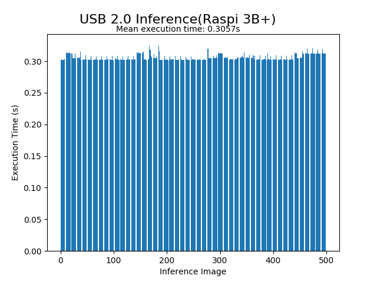
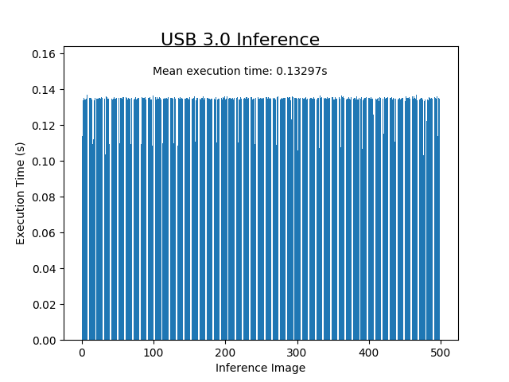

# prg_prgncs
PRG's Setup of Intel Neural Compute Stick

## Setup Instructions
- Start afresh with new Ubuntu 16.04 as the NCS API requires its own version of OpenCV which conflicts with other OpenCV Installations
- Install Movidis SDK 2 from https://github.com/movidius/ncsdk. Basic Instructions are given below:
  - ```
    git clone -b ncsdk2 https://github.com/movidius/ncsdk.git
    ```
  - ```
    make install
    ```

## Troubleshooting

   1. If you get an Error on line 498, try to delete the movidius file in the `/opt/` folder and run `make install` again.

   2. If the problem persists, check the `PYTHONPATH` and it should point it to the `/opt/movidius/caffe` folder. If it is not, then edit the `~/.bashrc` file to include the following:
   `export PYTHONPATH="${PYTHONPATH}:/opt/movidius/caffe/python"`

   3. If the `make examples` command also fails, then try to delete the folders that throw errors. For this installation we needed only tensorflow and hence deleted the folders `/caffe` inside `/examples` and `/multistick_cpp` inside `/examples/apps` and run `make install`.
   
   
   4. While running `make run` in the tensorflow examples, it might throw error with a `permission denied` exception. To solve this, change your permissions with the command:

      `chmod  755  -R /path/to/yourfolder`

## Running Code
- Change `BasePath` in `TrainIdentity.py` to point to the base directory of all CIFAR10 Images, for eg. `/home/ncs/Nitin/ncsdk/Nitin/SpectralCompression/CIFAR10`
- In the Folder `TxtFiles`, find and replace `/home/ncs/Nitin/ncsdk/Nitin/SpectralCompression/CIFAR10` with your path in both `DirNamesTrain.txt` and `DirNamesTest.txt`. This should be the same path as the first step
- Change Path on the first line in `RunNCS.sh`
- Train the network, convert to the form to be able to be read by NCS API, compile, profile and check code on NCS by running `./RunNCS.sh`. (Remember to give permissions first by using the command `sudo chmod -R 777 .`).
- Modify the Network in `Network/NetworkIdentity.py` making sure to follow the important notes given in this readme.
--------------------------------------------------------------------------------
## Important Notes

- For custom built tensorflow networks please follow the compilation guide for it to be NCS compatible [here.](https://movidius.github.io/ncsdk/tf_compile_guidance.html)
- Only certain layers are supported and the list can be found [here](https://github.com/movidius/ncsdk/releases).
- Using deconvolution is twitchy and does not work with strides if `padding="same"` is used. Use `padding="valid"` for strided deconvolutions.
- The following tests were conducted on this architecture: <br> 
`Input -> Conv(8, 5x5, 1x1, same, ReLU) -> Conv(16, 5x5, 1x1, same, ReLU) -> Conv(16, 5x5, 2x2, same, ReLU) -> Deconv(X, 5x5, YxY, valid, None) -> Ouptut` <br> Where `Conv(8, 5x5, 1x1, same, ReLU)` means  a convolutional layer with 8 filters, 5x5 kernel sized convolutions, 1x1 strides, same padding and ReLU activation.
- A table of tests with varying parameters and their outputs are given below: <br>

| X (Number of Filters) | Y (Strides)  | Output Size | Result | Inference Time (ms) |
| ---- | ---- | ---- | ---- | ---- | 
| 2 | 4 | 65x65x2 | Pass | 1.99 |
| 1 | 5 | 80x80x1 | Pass | 1.95 |
| 1 | 6 | 96x96x1 | Error 5 | NA |
| 80 | 5 | 80x80x80 | Pass | 2.61 |
| 1000 | 5 | 80x80x1000 | Error 25 | NA |
| 400 | 5 | 80x80x400 | Pass | 6.76 |

Error messages are given below: <br>
- Error 5: 
```
[Error 5] Toolkit Error: Stage Details Not Supported: Wrong deconvolution output shape.
```

- Error 25: 
```
E: [         0] dispatcherEventReceive:236	dispatcherEventReceive() Read failed -4

E: [         0] eventReader:254	Failed to receive event, the device may have reset

E: [         0] ncFifoReadElem:2736	Failed to read fifo element

GetResult exception
[Error 25] Myriad Error: "Status.ERROR".
```

## Results

### USB 2.0 vs USB 3.0:

Same image was inferred for 1000 iterations on a single image for [InceptionV1](https://github.com/tensorflow/models/tree/master/research/inception) dataset, taking into account the **image loading time** using cv2. 






## TODO
- [ ] Test by running custom model on NCS using API2

In the following table filters shows that many number of convolutional layers while downsampling and same goes for upsampling also. Check if it is USB 2.0 or USB 3.0. You can check it using `lsusb`. This tests were done with USB 2.0. Image size is [BWHC] [ batch size x width x height x color channels].

| Image size  |      Filters in subsequent layers      |  Time |
|----------|:-------------:|------:|
| 1 x 512 x 256 x 1 | [8,16,32,64] | 200 ms |
| 1 x 512 x 256 x 1 | [16,32,64,128] | 320 ms |
| 1 x 512 x 256 x 1 | [32,64,128,256] | Exception: Status.ERROR |
| 1 x 256 x 128 x 1 | [32,64,128,256] | Exception: Status.ERROR |
| 1 x 256 x 128 x 1 | [16,32,64,128] | 89 ms |
| 1 x 256 x 128 x 1 | [8,16,32,64] | 57 ms |
| 1 x 256 x 128 x 1 | [4,8,16,32] | 43 ms |
